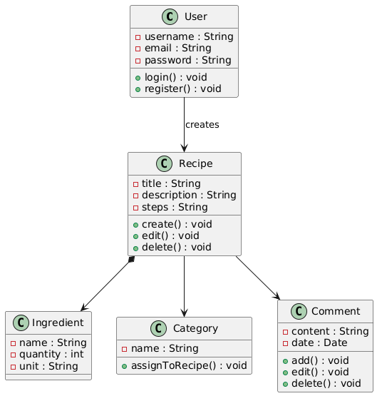

# Class Diagram

# Glossary

| Класс        | Описание                                                         |
|--------------|-----------------------------------------------------------------|
| `User`       | Сущность, представляющая пользователя приложения.                |
| `Recipe`     | Сущность, описывающая рецепт, созданный пользователем.           |
| `Ingredient` | Компонент рецепта, определяющий название, количество и единицу.  |
| `Category`   | Категория, к которой относится рецепт.                           |
| `Comment`    | Комментарии пользователей, оставленные к рецептам.              |
