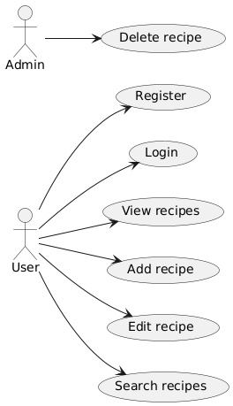

### Use Case Diagram

---

### Glossary

**Глоссарий к диаграмме вариантов использования**:
| Актер            | Описание                                       |
|------------------|-----------------------------------------------|
| `User`           | Пользователь приложения, создающий и ищущий рецепты. |
| `Admin`          | Управляет приложением, имеет права на удаление рецептов. |

---

### Event Flow

---

### Contents

1. [Actors](#1-actors)  
2. [Use Cases](#2-use-cases)  
    2.1 [Log into Account](#21-log-into-account)  
    2.2 [Register](#22-register)  
    2.3 [Search and Filter Recipes](#23-search-and-filter-recipes)  
    2.4 [Add Recipe](#24-add-recipe)  
    2.5 [Edit Recipe](#25-edit-recipe)  
    2.6 [Delete Recipe](#26-delete-recipe)  
    2.7 [Comment on Recipe](#27-comment-on-recipe)  

---

### 1 Actors

Актеры:  
- User  
- Admin  

---

### 2 Use Cases

---

#### 2.1 Log into Account

**Description.** Use case "Log into Account" allows a user to log into the application for managing their recipes and favorites.  
**Preconditions.** The user has chosen the "Sign in" option.  
**Main Flow.**
1. The application displays the login window;
2. The user enters their credentials (username and password);
3. The system verifies the entered data;
4. The system grants the user an "authorized" status;
5. The main page of the application is displayed;
6. The use case ends.

**Alternative Flow A1.**
1. The application displays an error message about incorrect credentials;
2. The use case terminates.

**Postconditions.** The user can access their recipes and perform actions such as adding or editing.

---

#### 2.2 Register

**Description.** The "Register" use case enables a user to create a new account in the system.  
**Preconditions.** The user has selected "Sign up".  
**Main Flow.**
1. The application displays the registration form;
2. The user enters the required details (username, email, password);
3. The system checks the uniqueness of the credentials;
4. The system creates a new account;
5. The system grants the user an "authorized" status;
6. The main page is displayed;
7. The use case ends.

**Alternative Flow A2.**
1. If the user provides already used credentials, the system notifies them;
2. Returns to the main flow with a prompt to enter new data.

---

#### 2.3 Search and Filter Recipes

**Description.** Allows users to search for and filter recipes based on their preferences.  
**Preconditions.** The user is logged into the application.  
**Main Flow.**
1. The user enters a search query;
2. The system searches the recipe database;
3. The system displays a list of matching recipes;
4. The use case ends.

**Alternative Flow A3.**
1. The user configures filtering options (e.g., by ingredients, category);
2. The system displays a filtered list of recipes;
3. The use case ends.

---

#### 2.4 Add Recipe

**Description.** Allows a user to add a new recipe to the database.  
**Preconditions.** The user is logged into the application.  
**Main Flow.**
1. The user navigates to the "Add Recipe" section;
2. The user fills out the form with the recipe details (name, ingredients, steps);
3. The system validates the input;
4. The system saves the new recipe;
5. The recipe is displayed in the user's profile;
6. The use case ends.

**Alternative Flow A4.**
1. If the data is invalid, the system shows an error message;
2. The user retries entering the data.

---

#### 2.5 Edit Recipe

**Description.** Allows a user to edit an existing recipe.  
**Preconditions.** The user is logged in and owns the recipe.  
**Main Flow.**
1. The user selects a recipe to edit;
2. The system displays the recipe details in editable form;
3. The user updates the recipe data;
4. The system saves the changes;
5. The updated recipe is displayed;
6. The use case ends.

**Alternative Flow A5.**
1. If the changes are invalid, the system shows an error message;
2. The user retries editing.

---

#### 2.6 Delete Recipe

**Description.** Enables a user or admin to delete a recipe.  
**Preconditions.** The user is logged in.  
**Main Flow.**
1. The user selects a recipe to delete;
2. The system prompts for confirmation;
3. The user confirms the deletion;
4. The recipe is removed from the database;
5. The use case ends.

---

#### 2.7 Comment on Recipe

**Description.** Allows users to leave comments on recipes.  
**Preconditions.** The user is logged in.  
**Main Flow.**
1. The user navigates to a recipe;
2. The user enters a comment;
3. The system saves the comment and associates it with the recipe;
4. The comment is displayed under the recipe;
5. The use case ends.

**Alternative Flow A7.**
1. If the comment is empty, the system prompts the user to enter content;
2. The use case resumes.

